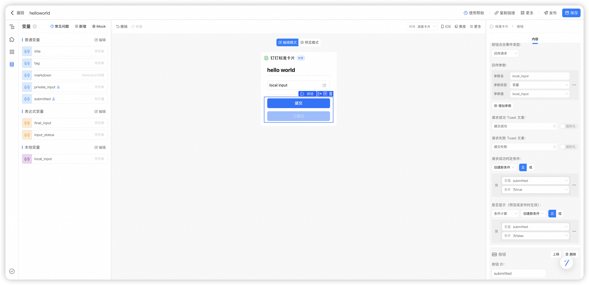

# 卡片介绍

这是一个卡片的 hello world，运行代码后给机器人发送消息，就能看到效果了。该示例演示了如何投放卡片、更新卡片、处理卡片回传请求等，可以用于验证卡片的开发环境是否成功配置。

视频演示：[hello world](https://wolai.dingtalk.com/89gp6tEDFQaXTM2RqDsd4f)

这个卡片使用了下面这些元素：

- 公有数据
- 私有数据
- 本地数据
- 表达式变量
- Markdown 组件
- 文本输入组件
- 按钮组件
- 卡片更新本地变量
- 卡片回传请求更新私有数据

# 卡片模板

