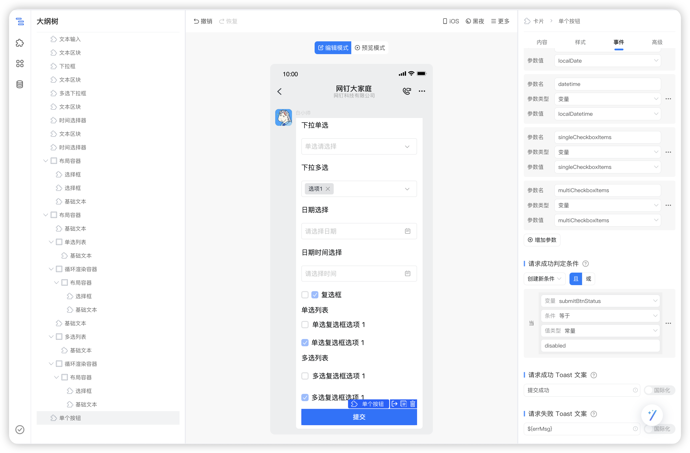

# 卡片介绍

这个卡片演示了卡片交互组件（如按钮、文本输入、日期时间选择、下拉框、多选下拉框、选择框、单选列表、多选列表）的使用与更新。交互组件一般有两种更新方式：回传请求和更新本地变量，该示例演示更新本地变量的方式来使用交互组件，并且演示了如何做必填校验和提示。

这个卡片使用了下面这些元素：

- 公有数据
- 私有数据
- 本地数据
- 按钮组件
- 文本输入组件
- 日期时间选择组件
- 下拉框组件
- 多选下拉框组件
- 选择框组件
- 单选列表组件
- 多选列表组件
- 卡片更新本地变量
- 卡片回传请求更新私有数据

# 视频演示

[交互组件的使用与本地更新](https://wolai.dingtalk.com/cpUtbjr8jjTa4GKUonaNMD)

# 卡片模板

