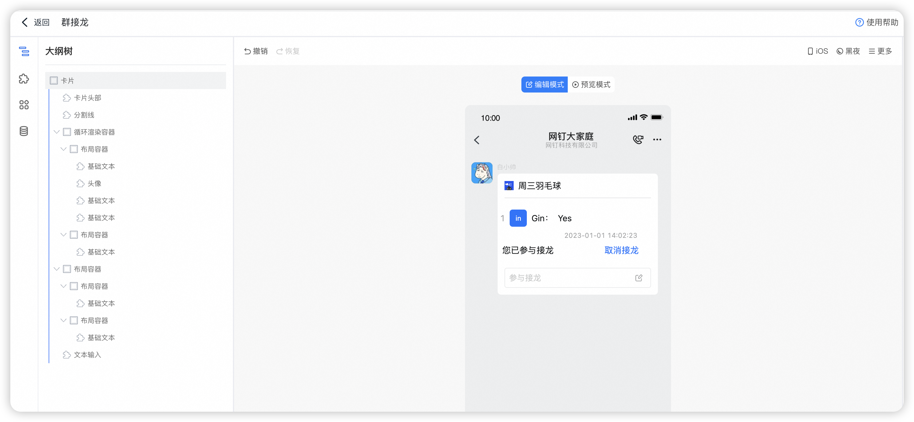

# 卡片介绍

这是一个演示如何使用循环渲染容器和文本输入组件实现群接龙的示例，这个示例也可以用于想要在卡片里实现用户评论功能的开发参考。

视频演示：[循环渲染容器之群接龙](https://wolai.dingtalk.com/99LsCipcu9fJCnNKaypC4W)

这个卡片使用了下面这些元素：

- 公有数据
- 私有数据
- 表达式变量
- 循环渲染容器
- 基础文本组件
- 文本输入组件
- 卡片回传请求更新卡片数据

# 卡片模板

